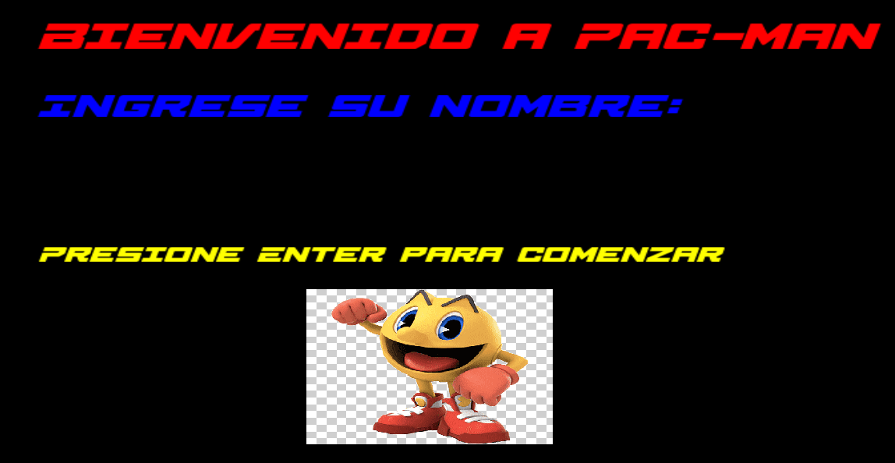

# PACMAN 
 
## Descripción General (Juego)

Es un juego clásico donde controlas a un personaje amarillo llamado Pac-Man que debe comer todos los puntos en un laberinto mientras evita ser atrapado por fantasmas. Puedes comer superpíldoras para volverte invulnerable temporalmente y perseguir a los fantasmas para ganar puntos adicionales. El objetivo es limpiar cada nivel del laberinto sin ser atrapado por los fantasmas que se vuelven más rápidos y astutos conforme avanzas en el juego.

## Fuente de apoyo 
https://youtu.be/_dqnnFUWT_Q?feature=shared
 
## Descripción General (Proyecto)

El objetivo de este proyecto es crear un video juego en base a lo que aprendimos durante el semestre.

## Objetivos Específicos

Los objetivos especificos de este proyecto son:
- Control del personaje (Ser capaz de manipular el movimiento del pacman)
- Comportamiento de los fantasmas (Desarrollar una lógica para los fantasmas que persiguen el pacman creando estrategias básicas de movimiento).

## Informacion
- **Personaje**: Clase base con métodos de movimiento.
- **Fantasma**: Clase derivada de Personaje con los mismos métodos.
- **Vida, Puntuacion, ObjetoComible, Jugador**: Clases adicionales mencionadas.
- **Relaciones**:
  - Jugador tiene una relación de composición con `Personaje (indicado por --*).
  - `Pacman hereda de Personaje (indicado por --|>).
  - `Fantasma hereda de Personaje` (indicado por --|>).
  - `Pacman tiene una relación de composición con `ObjetoComible.
  - `Jugador tiene una relación de agregación con Pacman (indicado por --o).
  - `Jugador tiene relaciones con Puntuacion y Vida.

## Metodos
Constructor: Carga una textura desde un archivo y la asigna a un sprite. Ajusta la posición y la escala del sprite.
Método draw: Dibuja el sprite en la ventana proporcionada.
Método getBounds: Retorna los límites globales del sprite para detección de colisiones.

Constructor: Carga una textura y la asigna a un sprite. Calcula el ancho y alto de cada frame de animación.
Método move: Mueve el sprite por los offsets proporcionados.
Método draw: Dibuja el sprite en la ventana proporcionada.
Método update: Actualiza el frame de animación basado en el tiempo transcurrido.

Constructor: Inicializa la puntuación a 0 y configura las propiedades del texto (fuente, tamaño, color, posición).
Método incrementar: Incrementa la puntuación y actualiza el texto mostrado.
Método dibujar: Dibuja el texto en la ventana proporcionada.

main: Crea una instancia de Fantasma y una ventana de SFML. En el bucle principal, maneja eventos, mueve el fantasma hacia abajo, limpia la ventana, dibuja el fantasma y muestra la ventana.

## Carpetas Utilizadas
- bin/ - Contiene los ejecutables del proyecto
- src/ - Contiene el codigo fuente
- include/ - Los archivos de cabecera
- images/ - Contiene los recuros del proyecto
- docs/ - Contiene la documentacion del proyecto
